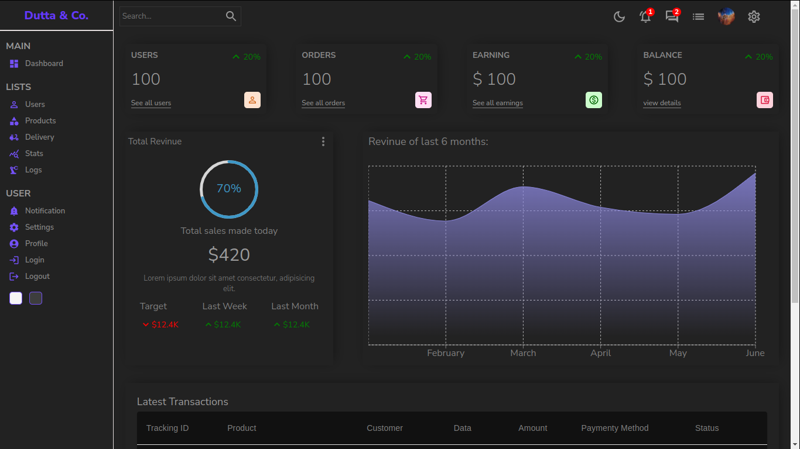

# Admin Panel Project
This project is an admin panel built using React. It uses several third-party libraries, such as Material UI, Firebase, Recharts, and more. The package.json file contains all the necessary dependencies to run the project.



## Installation
To install the project, first, make sure you have Node.js and npm installed. Then, clone the repository and navigate to the project directory in the terminal. Run the following command to install the dependencies:

```
npm install
```

## Usage
To start the project, run the following command:


```
npm start
```
This will start a development server on http://localhost:3000, and you can view the project in your web browser.

To build the project for production, run the following command:

```
npm run build
```
This will create a build folder with all the necessary files for deployment.


> **Test user:** Email: `testing@test.com`;  Password: `123456` 


## Dependencies
The project uses the following dependencies:

- "@emotion/react": "^11.10.6"
- "@emotion/styled": "^11.10.6"
- "@mui/icons-material": "^5.11.9"
- "@mui/material": "^5.11.9"
- "@mui/x-data-grid": "^5.17.25"
- "@testing-library/jest-dom": "^5.16.5"
- "@testing-library/react": "^13.4.0"
- "@testing-library/user-event": "^13.5.0"
- "firebase": "^9.17.1"
- "react": "^18.2.0"
- "react-circular-progressbar": "^2.1.0"
- "react-dom": "^18.2.0"
- "react-router-dom": "^6.8.1"
- "react-scripts": "5.0.1"
- "recharts": "^2.4.3"
- "web-vitals": "^2.1.4"
## Contributing
This project is not looking for any contributions.